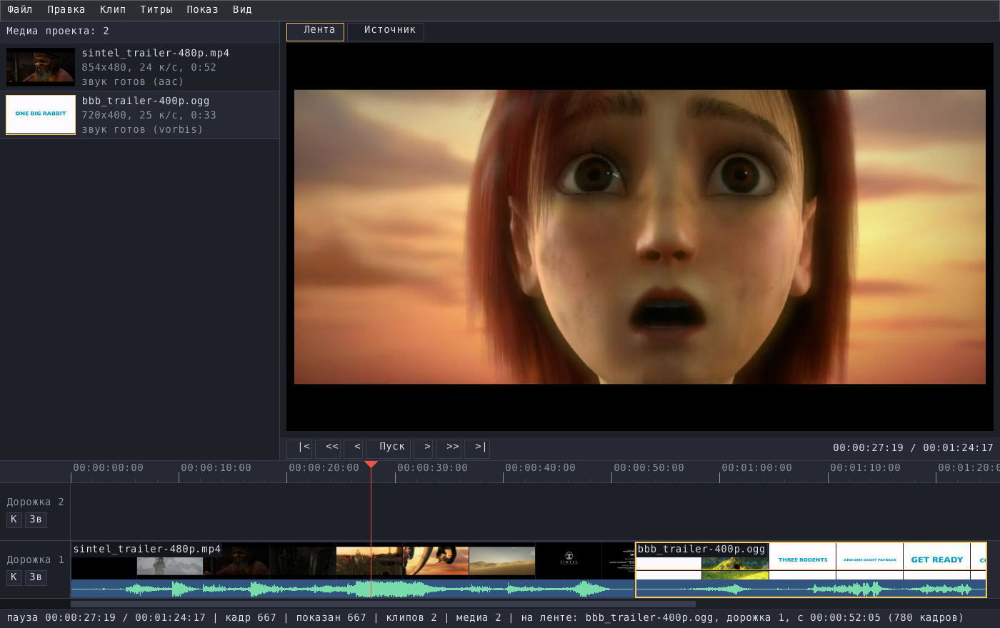
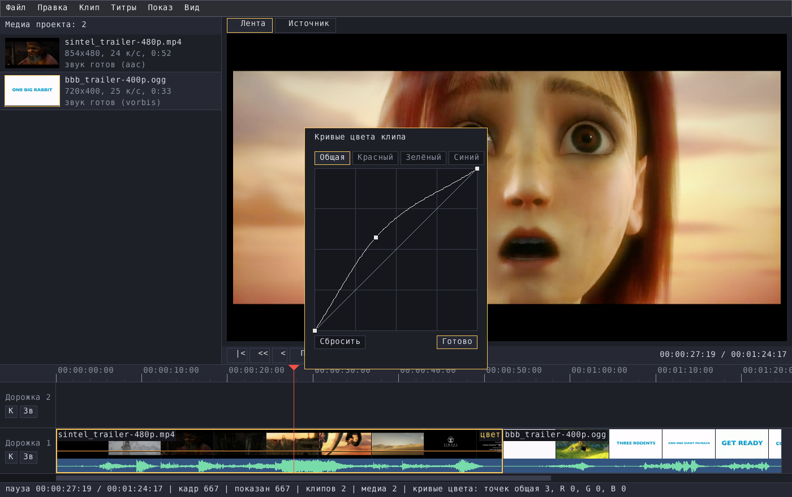

# Reviderum

**A video editor**, written from scratch in C++20: a media bin, source and
timeline monitors, tracks with thumbnails and waveforms, cuts, transitions,
effects, titles — and export back to a video file.



## What it does

- **Opens** mp4, mkv, mov, avi, webm, ts… (H.264, H.265, VP9 — whatever
  ffmpeg reads), audio files, and its own uncompressed `.y4m`.
- **Edits:** source monitor with in/out marks, append or insert on the
  timeline, split, ripple delete, copy/cut/paste, several tracks, markers,
  J/K/L shuttle, snapping, undo.
- **Transitions** on a splice; **clip effects** — brightness, contrast,
  saturation, fades; **colour curves** by mouse; **chroma key**;
  **picture in picture** (position and scale with keyframes); **speed**
  10…1000 %, reverse, freeze frame; **volume envelope**.
- **Titles** over the picture, including text **behind a tracked object**.
- **Output:** render the timeline to a video file, save a frame as PNG;
  projects are plain text `.rvp`.



## Running it

```sh
./reviderum
./reviderum examples/sintel_trailer-480p.mp4 examples/bbb_trailer-400p.ogg
```

Linux x86-64 with SDL2, and **ffmpeg** for reading and writing video
(`sudo apt install libsdl2-2.0-0 ffmpeg`); without ffmpeg only `.y4m`
files open. `assets/` (fonts) must sit beside the binary. The program keeps
its own window settings and caches in `settings/` next to the binary; it is
created on the first start.

`examples/` holds two open-movie trailers by the Blender Foundation —
"Sintel" (www.sintel.org) and "Big Buck Bunny" (www.bigbuckbunny.org),
both CC BY 3.0.

## По-русски

**Видеоредактор**, свой, на C++20: корзина медиа, мониторы источника и ленты,
дорожки с миниатюрами и звуком, монтаж, переходы, эффекты, кривые цвета,
хромакей, картинка в картинке, скорость, титры (в том числе за движущимся
объектом) и вывод ролика в файл.

Запуск: `./reviderum` или `./reviderum <ролики…>`. Нужен Linux x86-64,
SDL2 и **ffmpeg** (им читаются и пишутся ролики; без него открываются только
свои `.y4m`). Каталог `assets/` (шрифты) должен лежать рядом с бинарём.
Примеры — трейлеры открытых фильмов Blender Foundation «Sintel» и
«Big Buck Bunny» (CC BY 3.0).

License: MIT (see LICENSE).
